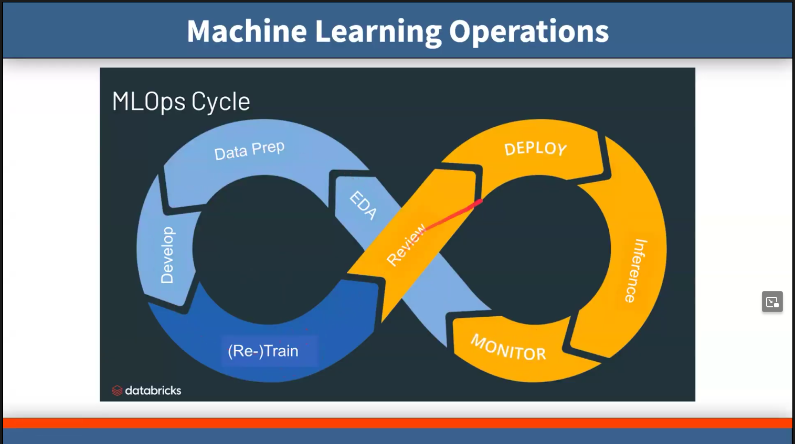

# Machine Learning Operations - MLOPS - Part1 - Introduction

## Overview
Building MachineLearning systems is hard. Some of the components you need:
1. Data Sources
2. Data Pipelines
3. Feature Stores
4. Model Training
5. Model Evaluation
6. Model Deployment
7. Model Monitoring
8. Predictions API




## MLOPS Introduction
MLOps is a practice for collaboration and communication between data scientists and operations professionals to help manage the production machine learning lifecycle. This includes production deployment, model monitoring, and health, and managing the model's lifecycle. MLOps applies to the entire lifecycle - from integrating with model training, building CI/CD pipelines, and deploying models to production. 


## MLOPS Components
### Data Sources
Data sources are the sources of data that you use to train your models. These can be databases, data lakes, APIs, etc.

### Data Pipelines
Data pipelines are the processes that you use to clean, transform, and prepare your data for training. These can be ETL jobs, data processing jobs, etc.

### Feature Stores
Feature stores are the stores that you use to store the features that you use to train your models. These can be databases, data lakes, etc.

### Model Training
Model training is the process of training your models using the data that you have prepared. This can be done using machine learning libraries like scikit-learn, TensorFlow, PyTorch, etc.

### Model Evaluation
Model evaluation is the process of evaluating the performance of your models using metrics like accuracy, precision, recall, etc.

### Model Deployment
Model deployment is the process of deploying your models to production so that they can be used to make predictions. This can be done using tools like Docker, Kubernetes, etc.

### Model Monitoring
Model monitoring is the process of monitoring the performance of your models in production. This can be done using tools like Prometheus, Grafana, etc.

### Predictions API
Predictions API is the API that you use to make predictions using your models. This can be a REST API, gRPC API, etc.

## MLOPS Tools
There are many tools available for MLOps. Some of the popular ones are:
1. Kubeflow
2. MLFlow
3. TFX
4. Seldon
5. Argo
6. Airflow
7. DVC
8. Feast
9. Cortex
10. KFServing
11. Sagemaker
12. DataRobot
13. H2O.ai
14. DataRobot
15. Pachyderm

## MLOPS Best Practices
1. Use version control for your code and data (e.g., Git
2. Use containers for your models (e.g., Docker)
3. Use automation for your pipelines (e.g., Jenkins, CircleCI)
4. Use monitoring for your models (e.g., Prometheus, Grafana)
5. Use logging for your models (e.g., ELK stack)
6. Use testing for your models (e.g., unit tests, integration tests)
7. Use security for your models (e.g., encryption, authentication)
8. Use collaboration for your models (e.g., Jupyter notebooks, Slack)
9. Use documentation for your models (e.g., README, Wiki)
10. Use reproducibility for your models (e.g., DVC, MLFlow)
11. Use scalability for your models (e.g., Kubernetes, Spark)
12. Use optimization for your models (e.g., hyperparameter tuning, model selection)
13. Use deployment for your models (e.g., Kubernetes, Seldon)

## MLOPS Challenges
1. Data Quality
2. Data Privacy
3. Model Interpretability
4. Model Fairness
5. Model Robustness
6. Model Scalability
7. Model Security
8. Model Governance
9. Model Compliance
10. Model Monitoring
11. Model Versioning
12. Model Deployment
13. Model Maintenance
14. Model Collaboration
15. Model Documentation
16. Model Reproducibility
17. Model Optimization

## Example code for MLOPS
- Single line code - basic example . Next parts will have more detailed examples.
- This code is for demonstration to show how to use MLOPS in practice. 
- It will load the hr dataset, train a linear regression model, and save the model to a file.
- The code is simple and easy to understand.


```python
print("Importing Libraries")
import pandas as pd 
import seaborn as sns
from sklearn.linear_model import LinearRegression
import pickle


# dataset 
# experience,test_score,interview_score,salary
data = {
    'experience': [0,  0,  5, 2,  7, 3, 10, 11],
    'test_score': [8,  8,  6, 10, 9, 7, 5,  7],
    'interview_score': [9, 6, 7, 10, 6, 10, 7, 8],
    'salary': [50000, 45000, 60000, 65000, 70000, 62000, 72000, 80000]
}

df = pd.DataFrame(data)

# model
lr = LinearRegression()
X = df[['experience', 'test_score', 'interview_score']]
y = df['salary']
model = lr.fit(X, y)
pickle.dump(model, open('salary-calculator.pkl', 'wb'))

# testing
trained_model = pickle.load(open('salary-calculator.pkl', 'rb'))
print(trained_model.predict([[2, 9, 6]]))
print(trained_model.predict([[5, 7, 10]]))

```

    
    New SalaryPrediction :)
    [53837.77000986]
    [67120.01434077]


## Explanation of the code
1. Importing Libraries
2. Creating a dataset (simple dataset with experience, test_score, interview_score, and salary)
3. Creating a dataframe from the dataset
4. Creating a Linear Regression model
5. Training the model
6. Saving the model to a file (salary-calculator.pkl) for later use, deployment(mobile app, web app, etc.)
7. Loading the model from the file
8. Making predictions using the model
9. The model predicts the salary based on the experience, test_score, and interview_score.

## Next Steps
* I hope you enjoyed this introduction to MLOps. In the next parts, we will dive deeper into each of the components of MLOps. Stay tuned!
* I will create a series of posts on MLOps. Here are the title of the posts:


1. Part1 - MLOPS - Introduction - Current Post
2. Part2 - MLOPS - Data Pipelines
3. Part3 - MLOPS - Model Training
4. Part4 - MLOPS - Model Deployment
5. Part5 - MLOPS - Model Monitoring
6. Part6 - MLOPS - Predictions API


## References
- https://ml-ops.org/
- https://en.wikipedia.org/wiki/MLOps
- https://www.databricks.com/glossary/mlops
- https://www.kdnuggets.com/10-github-repositories-to-master-mlops
