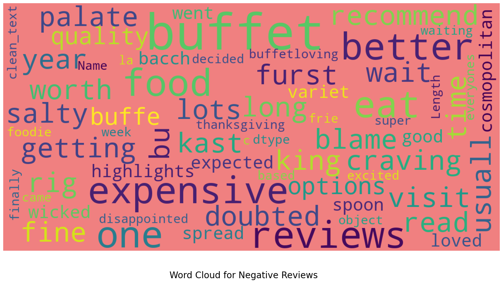

# NLP Sentiment Analysis on Restaurant Reviews

## Overview
* This project is a simple implementation of NLP Sentiment Analysis on Restaurant Reviews.
* The dataset contains 10417 reviews of a restaurant. 
* The goal is to predict whether a review is positive or negative. 
* The dataset downloaded from yelp.com website.

## Data Dictionary
* index: Index of the review
* review_id: Unique id of the review
* user_id: Unique id of the user
* business_id: Unique id of the business
* stars: Rating of the review
* useful: Number of useful votes
* funny: Number of funny votes
* cool: Number of cool votes
* text: Review text
* date: Date and time of the review

## Importing Libraries


```python
import pandas as pd
import numpy as np
import matplotlib.pyplot as plt
import seaborn as sns

import warnings
warnings.filterwarnings('ignore')
```

## Load the dataset


```python
df = pd.read_csv('restaurant.csv')
df.head()
```

## EDA - Exploratory Data Analysis
```python
print("Shaping the dataset")
df.shape
```
```text
Shaping the dataset
(10417, 10)
```

```python
print("Checking the columns information of the dataset")
df.info()
```
```text
    RangeIndex: 10417 entries, 0 to 10416
    Data columns (total 10 columns):
     #   Column       Non-Null Count  Dtype 
    ---  ------       --------------  ----- 
     0   Unnamed: 0   10417 non-null  int64 
     1   review_id    10417 non-null  object
     2   user_id      10417 non-null  object
     3   business_id  10417 non-null  object
     4   stars        10417 non-null  int64 
     5   useful       10417 non-null  int64 
     6   funny        10417 non-null  int64 
     7   cool         10417 non-null  int64 
     8   text         10417 non-null  object
     9   date         10417 non-null  object
```
```python
print("Viewing the random 5 rows of the dataset")
df.sample(5)
```

```python
print("Descriptive statistics of the dataset")
df.describe()
```

```python
print("Checking the unique values in the dataset")
df.nunique()
```

    Checking the unique values in the dataset
    ----------     -----
    review_id      10417
    user_id        10129
    business_id        1
    stars              5
    useful            57
    funny             43
    cool              47
    text           10393
    date           10417

```python
# df.useful.value_counts().sort_index(ascending=False)
# df.funny.value_counts().sort_index(ascending=False)
# df.cool.value_counts().sort_index(ascending=False)
```

```python
print("Checking the missing values in the dataset")
df.isnull().sum()
print("There is no missing value in the dataset")
```

    Checking the missing values in the dataset
    There is no missing value in the dataset


## Data Visualization


```python
print("Visualizing the distribution of the stars")
df.stars.value_counts().sort_index(ascending=False).plot(kind='bar')
```


## Data Conversion
The date column is in object format. We need to convert it into datetime format.

```python
print("Converting the date column into datetime format")
df['date'] = pd.to_datetime(df['date'])

df['year'] = df['date'].dt.year
df['month'] = df['date'].dt.month
df['day'] = df['date'].dt.day

```

```python
print("Visualizing the distribution of the year")
df.year.value_counts().sort_index(ascending=False).plot(kind='bar')
```


    

## Text Processing
The text column contains the reviews. We need to clean the text data before applying any machine learning model.

* Lowercasing the text
* Removing the punctuations, like . , ; ! ? " ' < > / \ | ( ) [ ] { } @ # $ % ^ & * - _ = +
* Removing the stopwords, like a, an, the, this, that, is, are, was, were, etc.
* Removing the digits, like 0, 1, 2, 3, 4, 5, 6, 7, 8, 9
* Removing the enter character, tabs, and new line character


```python
import re
import nltk
from nltk.corpus import stopwords

nltk.download('stopwords')
nltk.download('punkt')
nltk.download('wordnet')

def clean_text(text):
    text = text.lower()
    text = re.sub(r'[^\w\s]', '', text)
    text = re.sub(r'\d+', '', text)
    text = re.sub(r'\n', '', text)
    text = re.sub(r'\t', '', text)
    text = re.sub(r'\r', '', text)
    text = ' '.join([word for word in text.split() if word not in stopwords.words('english')])
    return text

df['clean_text'] = df['text'].apply(clean_text)

```

```python
df.clean_text.head()
```
    0    getting food poisoning palms hotel scared eat ...
    1    feast worthy godsbaccarnal buffet caesar palac...
    2    crab legs better ones wicked spoon huge prawns...
    3    worth salty food expensive furst kast visit bu...
    4    would give infinite stars could family diamond...

## Remove unnecessary columns
Removing the unnecessary columns from the dataset for the sentiment analysis.
Model will be trained on the clean_text column.


```python
df = df[['clean_text', 'stars', 'text']]
```

## World Cloud


```python
from wordcloud import WordCloud

def show_wordcloud(data, title = None, background_color = 'white'):
    wordcloud = WordCloud(
        background_color = background_color,
        max_words = 200,
        max_font_size = 40, 
        scale = 3,
        random_state = 42
    ).generate(str(data))

    fig = plt.figure(1, figsize = (20, 20))
    plt.axis('off')
    if title: 
        fig.suptitle(title, fontsize = 20)
        fig.subplots_adjust(top = 2.3) 
    plt.imshow(wordcloud)
    plt.show()

```

## Word Cloud for Positive Reviews
```python
show_wordcloud(df[df['stars'] > 3]['clean_text'], title='Word Cloud for Positive Reviews', background_color='lightgreen')
```


    


## Word Cloud for Negative Reviews
```python
print("Word Cloud for Negative Reviews")
show_wordcloud(df[df['stars'] <= 3]['clean_text'], background_color='lightcoral' , title='Word Cloud for Negative Reviews')
```



## Data Preprocessing

* Splitting the dataset into training and testing sets.
* Applying CountVectorizer to convert the text data into numerical format.
* Applying TF-IDF to convert the text data into numerical format.
* Applying LabelEncoder to convert the target variable into numerical format.
* Applying train_test_split to split the dataset.
* Applying the machine learning model.
* Checking the accuracy, confusion matrix, classification report.


* Importing the necessary libraries for the data preprocessing.
* Generate X and y variables.
  * X: Independent variable
  * y: Target variable

## Set target variable
```python
print("Setting the target variable")
df['sentiment'] = df['stars'].apply(lambda x: 1 if x > 3 else 0)
```

```python
from sklearn.feature_extraction.text import CountVectorizer
from sklearn.naive_bayes import BernoulliNB
from sklearn.model_selection import train_test_split 
from sklearn.metrics import accuracy_score, confusion_matrix, classification_report
```

```python
print("Generating X and y variables")
X = np.array(df['clean_text'])
y = np.array(df['sentiment'])
```

## Applying CountVectorizer
CountVectorizer is used to convert the text data into numerical format.


```python
cv = CountVectorizer()
X = cv.fit_transform(X)
X.shape
```
    (10417, 32324)

## Splitting the dataset into training and testing sets
Splitting the dataset into 80% training and 20% testing sets.


```python
print("Splitting the dataset into training and testing sets")
X_train, X_test, y_train, y_test = train_test_split(X, y, test_size=0.2, random_state=42)

```

## Bernoulli Naive Bayes Model
Applying the Bernoulli Naive Bayes model on the dataset.

```python
bn = BernoulliNB()
bn_model = bn.fit(X_train, y_train)
bn_y_pred = bn_model.predict(X_test)
print("Accuracy Score: ", accuracy_score(y_test, bn_y_pred))
```
    Accuracy Score:  0.7595969289827256

### Confusion Matrix Bernoulli Naive Bayes Model
Confusion matrix helps to understand the model performance. It shows the True Positive, True Negative, False Positive, and False Negative values.


```python
print("Confusion Matrix for Bernoulli Naive Bayes Model")
bn_cm = confusion_matrix(y_test, bn_y_pred)
print(bn_cm)
```

    Confusion Matrix for Bernoulli Naive Bayes Model
    [[ 343  361] [ 140 1240]]

```python
print("Visualizing the confusion matrix for Bernoulli Naive Bayes Model")
sns.heatmap(bn_cm, annot=True, fmt='d', cmap='Blues', xticklabels=['Negative', 'Positive'], yticklabels=['Negative', 'Positive'])
plt.xlabel('Predicted')
plt.ylabel('Actual')
plt.title('Confusion Matrix for Bernoulli Naive Bayes Model')
plt.show()
```


## Logistic Regression Model
Applying the Logistic Regression model on the dataset.

```python
from sklearn.linear_model import LogisticRegression
lr = LogisticRegression()
lr_model = lr.fit(X_train, y_train)
lr_y_pred = lr_model.predict(X_test)
print("Accuracy Score: ", accuracy_score(y_test, lr_y_pred))
```

    Accuracy Score:  0.8709213051823417

### Confusion Matrix Logistic Regression Model
```python
print("Confusion Matrix for Logistic Regression Model")
lr_cm = confusion_matrix(y_test, lr_y_pred)
print(lr_cm)
```

    Confusion Matrix for Logistic Regression Model
    [[ 557  147] [ 122 1258]]

```python
print("Visualizing the confusion matrix for Logistic Regression Model")
sns.heatmap(lr_cm, annot=True, fmt='d', cmap='Reds', xticklabels=['Negative', 'Positive'], yticklabels=['Negative', 'Positive'])
plt.xlabel('Predicted')
plt.ylabel('Actual')
plt.title('Confusion Matrix for Logistic Regression  Model')
plt.show()
```
    


## Random Forest Model
```python
from sklearn.ensemble import RandomForestClassifier
rf = RandomForestClassifier()
rf_model = rf.fit(X_train, y_train)
rf_y_pred = rf_model.predict(X_test)
print("Accuracy Score: ", accuracy_score(y_test, rf_y_pred))
```

    Accuracy Score:  0.8349328214971209

### Confusion Matrix Random Forest Model
```python
print("Confusion Matrix for Random Forest Model")
rf_cm = confusion_matrix(y_test, rf_y_pred)
print(rf_cm)
```

    Confusion Matrix for Random Forest Model
    [[ 405  299] [  45 1335]]

```python
print("Visualizing the confusion matrix for Random Forest Model")
sns.heatmap(rf_cm, annot=True, fmt='d', cmap='Greens', xticklabels=['Negative', 'Positive'], yticklabels=['Negative', 'Positive'])
plt.xlabel('Predicted')
plt.ylabel('Actual')
plt.title('Confusion Matrix for Random Forest Model')
plt.show()

```
    


## Basic Evaluation Metrics

### Accuracy
The accuracy score is the ratio of correctly predicted observations to the total observations.
#### Accuracy Formula =
    (TP + TN) / (TP + TN + FP + FN)
##### Naive Bayes:          
    [ [ 343  361 ] [ 140 1240 ] ]    (1240 + 343) / (1240 + 343 + 140 + 361) = 0.75
##### Logistic Regression:  
    [ [  557 147 ] [ 122 1258 ] ]    (1258 + 557) / (1258 + 557 + 122 + 147) = 0.87
##### Random Forest:        
    [ [  368 336 ] [ 44 1336 ] ]     (1336 + 368) / (1336 + 368 + 44 + 336) = 0.80

### Precision
It is the ratio of correctly predicted positive observations to the total predicted positives.
#### Precision Formula = 
    TP / (TP + FP)
##### Naive Bayes:          
    343 / (343 + 140) = 0.71
##### Logistic Regression:
    557 / (557 + 122) = 0.82
##### Random Forest:
    368 / (368 + 44) = 0.89
    

### Recall
Recall is a metric that measures how often a machine learning model correctly identifies positive instances (true positives) from all the actual positive samples in the dataset. 
### Recall Formula =
    TP / (TP + FN)
#### Naive Bayes:
    343 / (343 + 361) = 0.49
#### Logistic Regression:
    557 / (557 + 147) = 0.79
#### Random Forest:
    368 / (368 + 336) = 0.52

### F1 Score
The F1 score is the weighted average of Precision and Recall. Therefore, this score takes both false positives and false negatives into account.


```python
from sklearn.metrics import f1_score
print("F1 Score for Naive Bayes Model: ", f1_score(y_test, bn_y_pred))
print("F1 Score for Logistic Regression Model: ", f1_score(y_test, lr_y_pred))
print("F1 Score for Random Forest Model: ", f1_score(y_test, rf_y_pred))
```

    F1 Score for Naive Bayes Model:  0.8319355920831936
    F1 Score for Logistic Regression Model:  0.903411131059246
    F1 Score for Random Forest Model:  0.8858659588586596

```python
print("Sentiment Distribution")
df.sentiment.value_counts().plot(kind='bar', color=['lightcoral', 'lightgreen'], title='Sentiment Distribution')
```
    


## Conclusion
* Accuracy is the highest in the Logistic Regression model.
* Precision is the highest in the Random Forest model.
* Recall is the highest in the Logistic Regression model.
* F1 Score is the highest in the Logistic Regression model.

The Logistic Regression model is the best model for this dataset.

## Appendix
### Reuse the trained model and predict the sentiment of the reviews
When new reviews come, we can predict the sentiment of the reviews using the Logistic Regression model.


```python
def predict_sentiment(review):
    review = clean_text(review)
    review = cv.transform([review])
    prediction = lr_model.predict(review)
    if prediction == 1:
        return "Positive"
    else:
        return "Negative"

print("Positive Review: ", predict_sentiment("The food was very delicious and the service was very good."))
print("Negative Review: ", predict_sentiment("The food was very bad and the service was very poor."))

```

    Positive Review:  Positive
    Negative Review:  Negative


## References:
* https://en.wikipedia.org/wiki/Natural_language_processing
* https://scikit-learn.org/stable/modules/generated/sklearn.naive_bayes.BernoulliNB.html
* https://web.stanford.edu/~jurafsky/slp3/5.pdf
* https://scikit-learn.org/stable/modules/generated/sklearn.ensemble.RandomForestClassifier.html
* https://data.yelp.com/
* https://www.researchgate.net/profile/Zafer-Acar
* https://www.coursera.org/learn/ibm-exploratory-data-analysis-for-machine-learning
* https://www.kaggle.com/datasets/farukalam/yelp-restaurant-reviews
